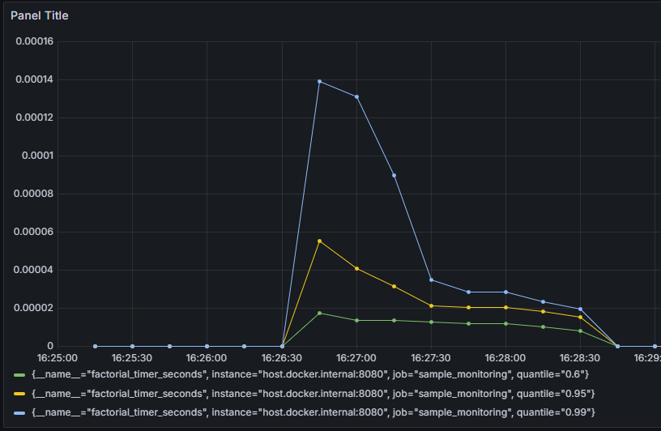
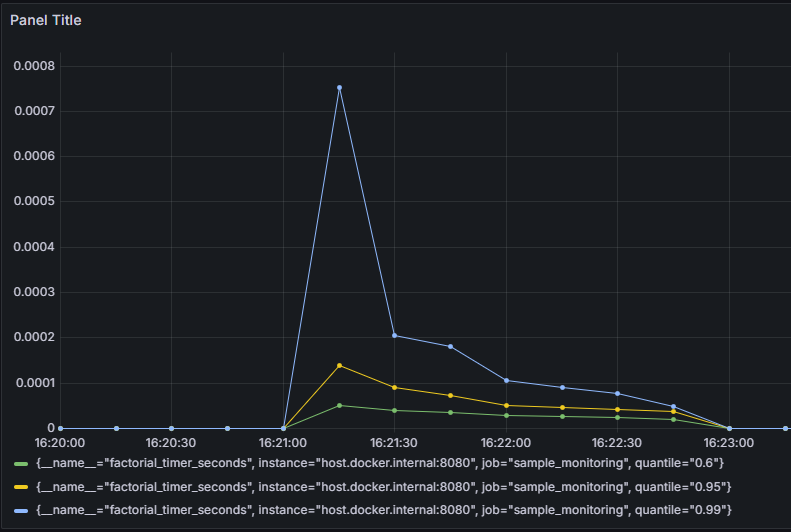
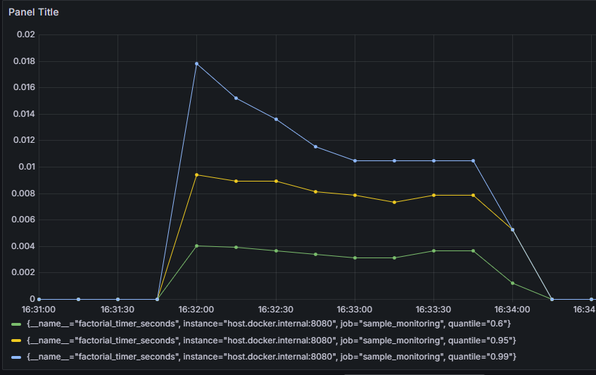
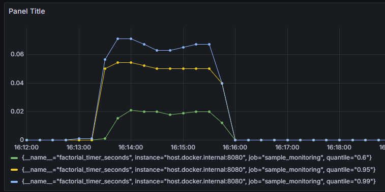

# Трайб «Риски Розничного бизнеса». Тестовое задание

Разработал микросервис, который удовлетворяет следующим условиям:
1. Принимает на вход по HTTP json:  {"factorial_num" : 5}
2. Вычисляет факториал числа, полученного в body
3. Возвращает рассчитанное значение в json формате:
   {"result" : 120 }
4. Присутствует обработка технических и бизнес-ошибок:
   - Число в запросе не должно превышать 10_000;
   - Число в запросе не должно быть отрицательным;
   - Поле factorial_num в запросе не должно быть null.
5. Сервис предоставляет технические метрики в формате Prometheus и health по
   HTTP. Добавлены кастомные метрики:
   - Счетчик запросов на вычисление факториала;
   - Таймер выполнения метода сервиса, расчитывающего факториал.
6. Предусмотрена сборка в Docker
7. Реализованы модульные тесты для сервисов и интеграционные для контроллера

### Стек
- Java 17
- Spring Boot 3.2.3
- Система сборки Maven
- Git
- Docker

### В рамках тестового задания реализовал два сервиса для вычисления факториала:
- SimpleFactorialService, наивный алгоритм
- TreeFactorialService, основанный на вычислении деревом

Второй алгоритм основан на том соображении, что длинные числа примерно одинаковой длины умножать эффективнее, 
чем длинное число умножать на короткое (как в наивной реализации). То есть нам нужно добиться, 
чтобы при вычислении факториала множители постоянно были примерно одинаковой длины.

### swagger документация:

## Сравнение двух сервисов по времени выполнения вычисления факториала
Для сравнения отправлял 1000 запросов из Postman с случайным числом в "factorial_num". 

### 1000 запросов с factorial_num в диапазоне [0, 100]:
<figure>
   
   <figcaption>
      Визуализация метрик на основе 1000 запросов с factorial_num в диапазоне [0, 100] для <b>TreeFactorialService</b>.
   </figcaption>
</figure>
<figure>
   
   <figcaption>
      Визуализация метрик на основе 1000 запросов с factorial_num в диапазоне [0, 100] для <b>SimpleFactorialService</b>.
   </figcaption>
</figure>

_Первый скрин для **TreeFactorialService**, второй - для **SimpleFactorialService**._

Из представленных метрик можно сделать вывод, что 99% запросов выполняются почти в пять раз быстрее
в сервисе TreeFactorialService.

### 1000 запросов с factorial_num в диапазоне [0, 10_000]:
<figure>
   
   <figcaption>
      Визуализация метрик на основе 1000 запросов с factorial_num в диапазоне [0, 10_000] для <b>TreeFactorialService</b>.
   </figcaption>
</figure>
<figure>
   
   <figcaption>
      Визуализация метрик на основе 1000 запросов с factorial_num в диапазоне [0, 10_000] для <b>SimpleFactorialService</b>.
   </figcaption>
</figure>

_Первый скрин для **TreeFactorialService**, второй - для **SimpleFactorialService**._
